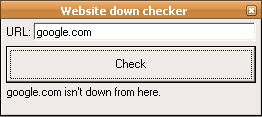



## Website down checker

### Description

This code uses downforeveryoneorjustme.com's server to detect if a website is down or not.

Don't enter URL with "WWW" or "HTTP://"
 
### More Info
 

             |
---                |---
**Submitted On**   |2010-01-17 05:10:02
**By**             |[SaLiXeM](https://github.com/Planet-Source-Code/PSCIndex/blob/master/ByAuthor/salixem.md)
**Level**          |Beginner
**User Rating**    |4.7 (14 globes from 3 users)
**Compatibility**  |VB 6\.0
**Category**       |[Internet/ HTML](https://github.com/Planet-Source-Code/PSCIndex/blob/master/ByCategory/internet-html__1-34.md)
**World**          |[Visual Basic](https://github.com/Planet-Source-Code/PSCIndex/blob/master/ByWorld/visual-basic.md)
**Archive File**   |[Website\_do2172981172010\.zip](https://github.com/Planet-Source-Code/salixem-website-down-checker__1-72844/archive/master.zip)

